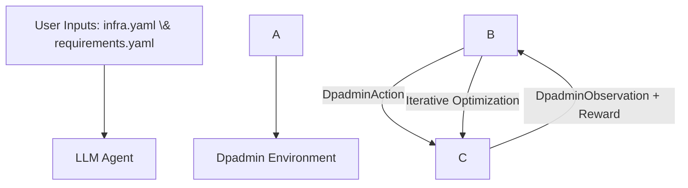

---

title: SRE Agent - Dpadmin (Data Protection Administrator)
emoji: 🛠️
colorFrom: blue
colorTo: green
sdk: docker
app_port: 8000
variables:
API_BASE_URL: "https://router.huggingface.co/v1"
MODEL_NAME: "Qwen/Qwen2.5-72B-Instruct"
base_path: /web
---

# SRE Autonomous Agent: Dpadmin Environment

The Dpadmin Environment simulates Data Protection tasks to train an agent in the best practices of data protection. The agent is an expert Site Reliability Engineer (SRE) designed to manage infrastructure lifecycle, redundancy, and disaster recovery.

Currently, it learns how to plan proactive data protection, reactive data protection, data backup retention and disaster recovery for an IT infrastructure, from the Dpadmin Environment.

The agent learns about the IT infrastructure from a YAML file. It learns about the *business requirements* from another YAML file. It then proposes data protection configurations to the Dpadmin Environment. The environment, having learnt from the same YAML files, uses *deterministic rules* that are based on industry best practices to evaluate the agent's configurations. Dpadmin Environment sends feedback to the agent which uses it to improve its configuration if necessary.

The environment provides training in 4 tasks:

|Task ID|Domain|Objective|
|-|-|-|
|`id\_setup\_redundancy`|Proactive Protection|Optimization of hardware-level redundancy (RAID) and replication.|
|`id\_backup\_lifecycle`|Reactive Protection|Configuration of snapshot and backup execution frequency.|
|`id\_setup\_retention`|Data Lifecycle|Configuration of long-term backup and snapshot retention periods.|
|`id\_dr\_recovery`|Disaster Recovery|Execution of system restoration to valid states (PITR/Latest).|

## Architectural Workflow

The interaction between the Agent and the Dpadmin Environment follows a synchronous control loop:

**Ingestion**: The Agent and Environment ingest the system topology (infra.yaml) and service level objectives (requirements.yaml).

**Action Selection**: The Agent maps requirements (e.g., RPO, Compliance) to API calls (SET\_POLICY, SET\_RETENTION etc) for each resource. This activity is driven *purely by prompts*. That is, given infra.yaml, requirements.yaml and per-task prompt, the agent creates data protection configuration actions. These are passed to the environment for feedback.

**Simulation \& Scoring**: The Environment evaluates actions against deterministic rules (e.g., RPO vs. storage cost, SOX compliance) and returns state telemetry.

**Optimization**: The Agent uses integrity\_score, rpo\_gap\_min, and reward feedback to converge on an optimal protection strategy.

## Configuration Variables

The environment supports 4 tasks:

1. **Proactive Data Protection**
This task teaches the agent how to pick data storage protection techniques such as RAID levels. In order to run this task, set environment variable DPADMIN\_TASK: "id\_setup\_redundancy" .
2. **Reactive Data Protection**
This task teaches the agent how to pick data protection techniques such as snapshots, backups. In order to run this task, set environment variable DPADMIN\_TASK: "id\_backup\_lifecyle" .
3. **Disaster Recovery**
This task teaches the agent how to pick data recovery techniques such as point-in-time restore. In order to run this task, set environment variable DPADMIN\_TASK: "id\_dr\_recovery".
4. **Data Backup Retention**
This task teaches the agent the optimal retention period and deduplication ratio for backup copies of data. To run this task, set the environment variable DPADMIN\_TASK: "id\_setup\_retention".

## Environment Specification

The **Dpadmin Environment** is a simulated infrastructure management platform.
The user specifies the IT infrastructure that contains the data assets to be protected in a YAML file. The user also specifies the data protection requirements in another YAML file.
The environment uses these descriptions to train an LLM agent in data protection planning.

**The IT Infrastructure Description File**

This is called *infra.yaml* and is stored in 2 directories:

1. infra\_data in the root directory
2. server/model

The contents of *infra.yaml* are:

1. **hosts**
   This specifies the DNS names of systems running applications in the IT infrastructure. Each system's storage capacity is specified using *total_capacity_gb*.

2. **apps**
   This specifies applications that are deployed in the IT infrastructure. Each application's data growth is specified using *daily_change_percent* and is used to calculate backup growth.

3. **data_storage**
   This specifies the data storage products deployed.

4. **network_connections**
   This specifies L3 network reachability between different hosts.

5. **relationships**
   This specifies the relation between the hosts, applications and storage systems.

6. **classification**
   This specifies the importance of the data created by the applications to the business. This is divided into Tiers where Tier 1 is highest priority and Tier 3 is lowest. Also, regulatory requirements such as "PII/Regulated" can be specified here.

   **PLEASE NOTE**: Not all values are currently used.

**The Business Requirements File**

This is called *requirements.yaml*. Its contents are specified as a list of tuples *Scope, Strictness, Description*. *Scope* can be either *Functional* or *Non-functional*. *Strictness* can be either *Mandatory* or *Optional*. The files contents are:

1. **Functional Requirement**

   This specifies functionality that is required. These are used to specify requirements such as RPO, RTO, Availability.

2. **Non-Functional Requirements**

   These specify the qualitative requirements.

Each requirement has the format:

   \[<"functional" | "nonfunctional">, <"mandatory" | "optional">, < description text >]

   ## Action \& Observation Spaces

   ### **Action Space**

   The agent interacts via a Pydantic-validated `DpadminAction` model:

1. **Reactive Data Protection Actions**
* `SET\_POLICY(target, policy)`:

  Configure Snapshot, Backup frequency.

  Here *target* is the host/app/storage system as specified in the *infra.yaml*.

  Valid *policy* are:

  (a) SNAPSHOT\_15MIN: Snapshots every 15 minutes,

  (b) BACKUP\_HOURLY: Save backups every 60 minutes

  (c) BACKUP\_DAILY: Save backups every 24 hours

* `SET\_RETENTION(target, days)`:

  Here *target* is the host/app/storage system as specified in the *infra.yaml*.

  *days* refers to the number of days after which a snapshot or a backup must be deleted.

2. **Disaster Recovery Actions**
* `EXECUTE\_RECOVERY(target, params)`: Perform system restoration.

  Here *target* is the host/app/storage system as specified in the *infra.yaml*.

  Valid *params* are POINT\_IN\_TIME and RESTORE\_LATEST.

3. **Proactive Data Protection Actions**
* `SET\_REDUNDANCY(target, mode)`: Configure RAID/Replication.

  Here *target* is the host/app/storage system as specified in the *infra.yaml*.

  Valid *modes* are:
(a) None: No data redundancy measures are configured

  (b) RAID1: RAID 1 is configure

  (c) RAID5: RAID 5 is configured

  (d) RAID6: RAID 6 is configured

  (e) RAID10: RAID 10 is configured

  (e) REPLICATION: replicas are created to another site

  (f) REPLICATION+RAID\[1/5/6/10]: both redundancy and replication are configured

4. **Backup Retention Actions**
* `SET\_RETENTION(target, period, dedup)`: Retain for *period* and apply *dedup* level deduplication

  Here *target* is the host/app/storage system as specified in the *infra.yaml*.

  *period* is the retention duration in years.

  *dedup* is the deduplication ratio to be applied for the backups.

  ### **Observation Space**

  The environment returns a `DpadminObservation` containing:

  **timestamp (str)**: The current simulation time, used for sequencing protection events.

  **rpo\_gap\_min (int)**: Minutes elapsed since the last successful protection event. This is the primary metric for RPO SLA compliance.

  **io\_latency\_ms (float)**: Real-time I/O latency. High values indicate that protection tasks (like backups) are impacting production performance.

  **status\_code (int)**: Operational status of the target system (1 for ONLINE, 0 for OFFLINE/FAILURE).

  **integrity\_score (float)**: Data verification status (1.0 is clean, < 1.0 indicates potential data corruption or ransomware signatures).

  ### **Event Flow**

  This is description of how an agent can use our environment to get training in Data Protection.

1. User provides *infra.yaml* and *requirements.yaml* to both the LLM Agent and our environment.
2. The agent uses *requirements.yaml* and appropriate prompts to decide data protection actions *for each host, application and data storage system* in the IT infrastructure.
These actions are specific to the 4 tasks defined currently.
3. The agent passes the action to the environment in step() function.
4. The environment uses the same *infra.yaml* and *requirements.yaml* to determine the ideal reward for agent's actions based on pre-determined rules and simulation logic.
It responds with observation that contains the reward.
5. The agent strives to achieve the highest reward for an action by using feedback in the observation returned.

   ## Local Setup

   If you want to run this locally on your own hardware:

1. Install [Ollama](https://ollama.com).
2. Run `ollama run qwen2.5:7b`.
3. Update `inference.py` to use `base\_url="http://localhost:11434/v1/"`.
4. Run `python inference.py`.

